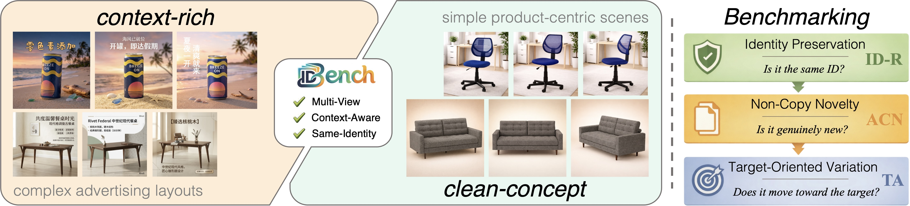
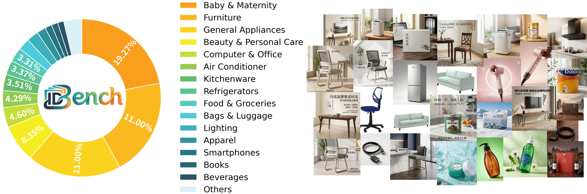
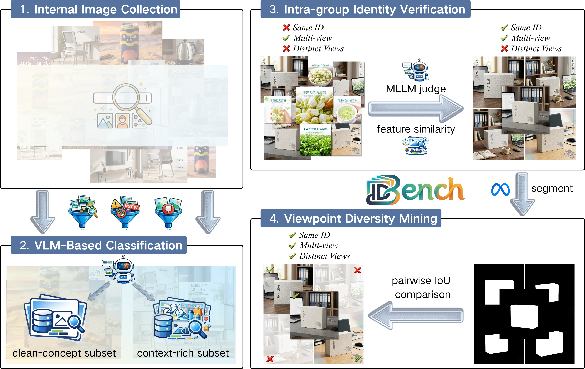

# ID-Bench: A Real-World Benchmark for Multi-Reference Identity-Preserving Image Generation

<div align="center">

[](https://2027.ieeeicassp.org/)

**[Project Page](https://zyyyz.github.io/IDBench)**

</div>

---

## Overview

Recent advances in image generation have enabled high-quality synthesis from visual references, yet evaluating multi-reference identity-preserving generation remains challenging. Existing benchmarks often conflate genuine generation with trivial copying and lack fine-grained measures of target-directed variation. We introduce **ID-Bench**, a real-world benchmark built from e-commerce advertising images and organized by product identity. ID-Bench spans two complementary subsets, clean-concept and context-rich, and contains 50k product identities with approximately 200k images. We further propose a layered evaluation framework that measures identity preservation, anti-copy novelty, and target alignment. Benchmarking representative open-source and proprietary models shows that coarse-grained identity retention is already relatively strong, whereas larger gaps remain in non-copy generation and target-guided control. ID-Bench provides a practical and reproducible testbed for future research on identity-preserving multi-reference generation.
We hope ID-Bench will advance both benchmarking and model development for this task.




---

## Dataset

ID-Bench comprises:

- **50,000** product identities
- **~200,000** images sourced from real-world e-commerce advertising
- **2** complementary evaluation subsets:
  - **Clean-Concept**: Simple, product-centric scenes for controlled evaluation
  - **Context-Rich**: Complex advertising layouts with diverse backgrounds and compositions




---

## Dataset Construction Pipeline




---

## Evaluation Framework

ID-Bench introduces a **hierarchical three-metric evaluation framework**:


| Metric   | Name                   | Description                                                                                                                                                                                                                                                       |
| -------- | ---------------------- | ----------------------------------------------------------------------------------------------------------------------------------------------------------------------------------------------------------------------------------------------------------------------- |
| **ID-R** | **Identity Retrieval** | A basic identity-preservation metric that measures whether the generated image can be retrieved as the correct product instance among all benchmark identities in an identity-level retrieval task.                                                                     |
| **ACN**  | **Anti-Copy Novelty**  | A track-specific metric that measures whether the generated image achieves a degree of novelty relative to the conditioning set comparable to that of the real held-out target, thereby distinguishing genuine same-identity generation from copy-prone behavior.       |
| **TA**   | **Target Alignment**   | A track-specific metric that measures whether the generated image moves toward the intended held-out variation, departing from the conditioning context with a direction and magnitude consistent with the real held-out target under target-specific textual guidance. |


Two evaluation tracks are provided:

- **Track A — Unified-Prompt**: All models receive the same standardized text prompt. Metrics: ACN ↑, FID ↓, CLIP-IQA ↑.
- **Track B — Caption-Guided**: Models are provided with rich auto-generated captions. Metrics: TA ↑, DA ↑, MA ↑, CLIP-IQA ↑.

---

## Benchmarked Models

We benchmark **8 state-of-the-art models** (3 closed-source, 5 open-source):

| Model | Type |
|-------|------|
| Nano-Banana | Closed-source |
| GPT-Image-1 | Closed-source |
| Seedream-5.0-Lite | Closed-source |
| Flux2-Klein-9B | Open-source |
| Qwen-Image-Edit | Open-source |
| Flux2-Dev | Open-source |
| FireRed-Image-Edit | Open-source |
| GLM-Image | Open-source |

---

## BibTeX

If you find this work useful, please cite:

```bibtex
@inproceedings{idbench2027,
title     = {ID-Bench: A Real-World Benchmark for Multi-Reference
               Identity-Preserving Image Generation},
author    = {Anonymous Author(s)},
booktitle = {ICASSP 2027},
year      = {2027}
}
```

---

## License

This project is for research purposes only. The dataset and code will be released under appropriate open licenses upon publication.
